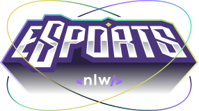
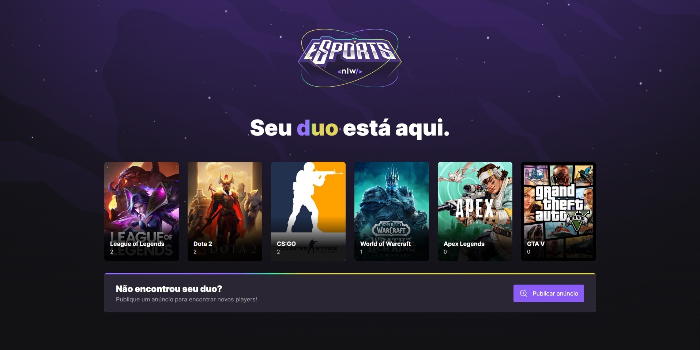

<p align="center">
</p>

<br>

 Projeto desenvolvido pela [RockeatSeat](https://www.rocketseat.com.br/) para o NLW eSports.


<hr>

<br>

  - [Descrição](#descrição)
  - [Tecnologias](#tecnologias)
  - [Quickstart](#quickstart)

<br>

## Descrição

O projeto se chama *Encontre seu Duo*.
Possui um back-end em Node.js que integra web (React) e mobile (React Native) com o mesmo banco de dados, e serve para juntar pessoas que querem o duo ideal para jogar!

<br>
<p align="center">
</p>

<br>

## Layout do projeto
* [Figma](https://www.figma.com/file/j7VUMFznvDjZdeAdU2UrSa/NLW-eSports-(Community)?node-id=0%3A1)

## Tecnologias
* [Node.js](https://nodejs.org/en/)
* [Prisma](https://www.prisma.io/)
* [React](https://reactjs.org/)
* [React Native](https://reactnative.dev/)
* [Expo](https://expo.dev/)
* [Figma](https://www.figma.com/)
* [Radix UI](https://www.radix-ui.com/)
* [TailwindCSS](https://tailwindcss.com/)


## Quickstart

### Server

Primeiro, crie um novo arquivo ``.env`` no diretório raiz, usando o modelo `.env.example` como base.

Em seguida, para criar o banco de dados local, execute:
```sh
$ npm install
$ npm run db:migrate
```

Depois, para iniciar o servidor, execute:
```sh
$ npm run dev
```

### Web

Para executar o cliente web local do Vite:
```sh
$ npm install
$ npm run dev
```
